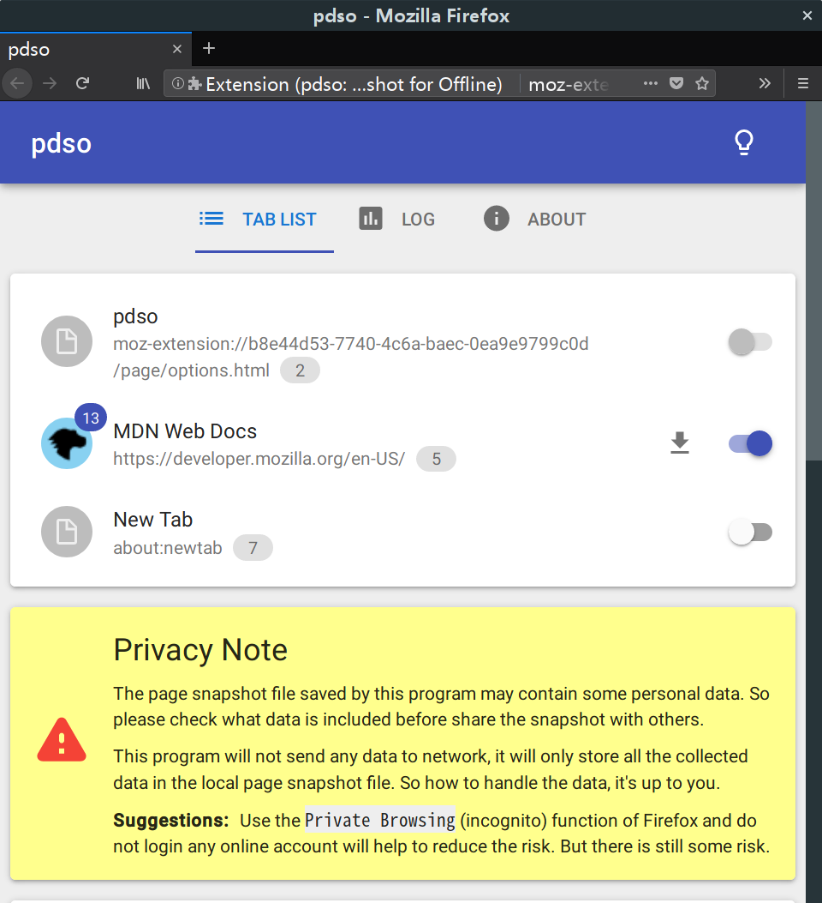
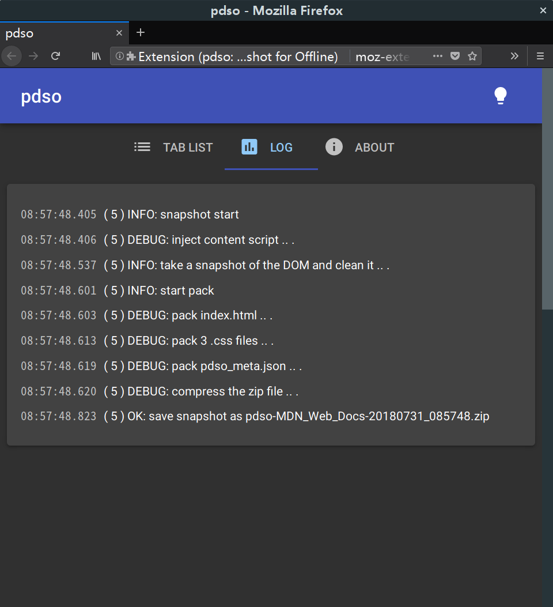

<!-- README.md, pdso/doc/en/ -->

# pdso: Page DOM Snapshot for Offline
<https://bitbucket.org/eisf/pdso/>

(An extension for **Desktop** and **Android** `Firefox`)

Take a static snapshot of the page DOM,
 (modify and) save it for offline viewing,
 including CSS styles and images, no script.


## Features

+ Take a static snapshot of the dynamic page, and save it as HTML, not picture.

+ Keep all the styles and images, what you see is what you get.

+ Remove all the scripts in saved HTML.

+ Pack all the files (the HTML file, images, CSS files) in a zip archive.


## Installation and usage

Install `pdso` on AMO: <https://addons.mozilla.org/en-US/addon/pdso/>



1. Click the switch on the right to enable the tab which you want to snapshot.

2. You may need to refresh the page to reset.

3. Click the download button to start snapshot !



**Suggestions**: Please use the latest Firefox to view the saved snapshot to
 get the best display effect.


## How it works

While this extension is running, it will monitor browser tabs with
 [tabs](https://developer.mozilla.org/en-US/docs/Mozilla/Add-ons/WebExtensions/API/tabs)
 and
 [webNavigation](https://developer.mozilla.org/en-US/docs/Mozilla/Add-ons/WebExtensions/API/webNavigation)
 API of the Firefox extension in the background.

When a tab enabled,
 it will record the data of all the resources loaded by the page with
 [webRequest](https://developer.mozilla.org/en-US/docs/Mozilla/Add-ons/WebExtensions/API/webRequest)
 and
 [StreamFilter](https://developer.mozilla.org/en-US/docs/Mozilla/Add-ons/WebExtensions/API/webRequest/StreamFilter)
 API.

When snapshot, it will inject
 [content script](https://developer.mozilla.org/en-US/docs/Mozilla/Add-ons/WebExtensions/API/contentScripts)
 in the page, and snapshot the DOM
 ([`document.cloneNode(true)`](https://developer.mozilla.org/en-US/docs/Web/API/Node/cloneNode)).
Then clean and modify the document, such as remove `<script>`,
 modify `<link rel="stylesheet" href="" />` and ``.

Finally,
 [make the document HTML](https://developer.mozilla.org/en-US/docs/Web/API/XMLSerializer)
 and pack `.css` files, images, etc.
Compress them with [JSZip](https://stuk.github.io/jszip/), and
 [save](https://developer.mozilla.org/en-US/docs/Mozilla/Add-ons/WebExtensions/API/downloads)
 it.


## Known issues

+ Currently this program can not pack all the resources of a page,
   and can not deal with all the circumstances.
  So the snapshot may look some what different from the original page.


## Roadmap

+ *(TODO)* Add support for resources loaded by CSS, such as background image,
  web font, etc.  (parse CSS)

+ *(TODO)* Add support for `<frame>` and `<iframe>`.

+ *(TODO)* Capture `<canvas>` and save it as picture.

+ *(TODO)* Save other resources such as video and audio.


## CHANGELOG

[CHANGELOG.md](CHANGELOG.md)


## Build from source

1. Install [`node.js`](https://nodejs.org/en/) and
  [`yarn`](https://yarnpkg.com/en/).

2. Run the following commands in the project root directory:

  ```
  > yarn install

  > yarn run build-release

  ```


## LICENSE

```
pdso: Page DOM Snapshot for Offline
Copyright (C) 2018  sceext

This program is free software: you can redistribute it and/or modify
it under the terms of the GNU General Public License as published by
the Free Software Foundation, either version 3 of the License, or
(at your option) any later version.

This program is distributed in the hope that it will be useful,
but WITHOUT ANY WARRANTY; without even the implied warranty of
MERCHANTABILITY or FITNESS FOR A PARTICULAR PURPOSE.  See the
GNU General Public License for more details.

You should have received a copy of the GNU General Public License
along with this program.  If not, see <http://www.gnu.org/licenses/>.
```
